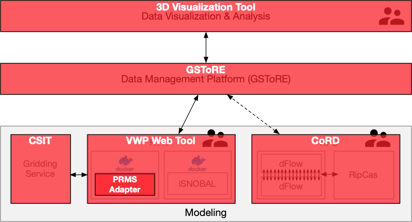

---
title: "WC-WAVE Virtual Watershed Platform Software Components"
...

Web Version: [https://virtualwatershed.github.io/vwp-project-info/](https://virtualwatershed.github.io/vwp-project-info/)

The Virtual Watershed Platform developed as part of the NSF Funded Western Consortium Watershed Analysis, Visualization and Exploration ([WC-WAVE](http://westernconsortium.org)) project and included multiple software components that were integrated (Figure 1) through a common data management hub based on the [*Geographic Storage, Transformation and Retrieval Engine (GSToRE)*](http://gstore.unm.edu). 

The developed software components include:

* [**GSToRE**](http://gstore.unm.edu) based Virtual Watershed data management platform. The data management platform was developed to enable research data management, discovery, and access for both spatial and non-spatial data. It uses a services-oriented architecture that is based on a combination of multiple database platforms and a Python-based API that implements a combination of custom RESTful APIs and standards-based Open Geospatial Consortium services. [http://doi.org/10.5281/zenodo.831213](http://doi.org/10.5281/zenodo.831213)

* **VWP Web Tool**. The VWP Web Tool is used to create model runs, generate scenarios, visualize model files, and share data. This tool has a user-friendly interface that enables a user to define and execute complicated modeling jobs by clicking buttons, a much easier procedure than the traditional workflow that an environmental scientist needs to manually execute to change model inputs. It is also able to visualize and compare results. Different hydrological models can be integrated into this tool. The execution part of Docker Worker should be updated and other system components can be reused. [http://doi.org/10.5281/zenodo.831226](http://doi.org/10.5281/zenodo.831226)

* **3D Visualization Tool.**  A Unity Visualization Tool is used to visualize geographic data in a 3D world~\cite{carthen_hpc-vis_2017}. A user can travel in the 3D world, access local and remote VWP data, and display results. In addition to the traditional visualization method, such as line chart and table, the tool can also render data on a 3D terrain and update data based on timestamp. [https://github.com/HPC-Vis/Virtual-Watershed-Client](https://github.com/HPC-Vis/Virtual-Watershed-Client)

* **PRMS Adapters.** The PRMS Adapters are a set of tools for programmatic creation and manipulation of PRMS (input, parameter, and output) files and for running PRMS itself. The adapters facilitate the use of NetCDF for PRMS, enabling anyone who knows how to use NetCDF to use PRMS. Without these adapters, one would have to learn the PRMS-specific file format, and convert their data to match that format. [https://doi.org/10.5281/zenodo.831222](https://doi.org/10.5281/zenodo.831222)

* **CoRD.** The Coupled RipCAS-DFLOW model has two distinct contributions in one
repository. First, we developed RipCAS, the Riparian Community Alteration and Succession model, in Python to model vegetation succession in a floodplain. An existing model of this type existed but was not free and open source, and it had no API, only a Windows user interface. Second, we built infrastructure to couple RipCAS to  DFLOW, This infrastructure includes data converters, a boundary-condition solver, and logic to automatically submit a new DFLOW job to the cluster for each year  of the simulation, which may stretch many decades.   DFLOW is computationally intensive and is run in parallel.  Future work should focus on tools for making the process of parallel job submission easier. To this end, we have begun prototyping a web interface for CoRD, which is now controlled through a command-line interface on the computing cluster. Although our automatic job submission system is specialized for CoRD, the general idea could be applied to any computationally-intensive program that is run over many years on a cluster. [https://doi.org/10.5281/zenodo.831215](https://doi.org/10.5281/zenodo.831215)

* **CSIT.** The WC-WAVE Climate Station Interpolation Toolkit (CSIT). CSIT is a set of tools for creating spatially interpolated grid surfaces from climate station data by time-step. Included is a cross validation toolkit that produces several uncertainty surfaces for each interpolation time step and records the processing time required to calculate each grid surface. [https://doi.org/10.5281/zenodo.1012362](https://doi.org/10.5281/zenodo.1012362)

Additional software utilities that were developed by the project include:

* **Data Converter Tool.** The Data converter tool was created to convert files formats. A user can convert the text files into NetCDF files and vise-versa. The data converter is necessary because NetCDF file is commonly used in the web tool but most models only accept and generate text files. This tool enables the connection between different components of the project and also allows a user to convert a file into different formats with graphic user interfaces. [http://doi.org/10.5281/zenodo.831219](http://doi.org/10.5281/zenodo.831219)

----------------------

This material is based upon work supported by the National Science Foundation's Established Program to Stimulate Competitive Research (EPSCoR) under grant numbers IIA-1329469,  <!-- NV Track 2 (no track 1 funds from NV for this project.) -->
IIA-1329513, <!--  % ID Track 2 (IWG) -->
IIA-1301346, <!--  % NM Track 1 -->
0814449, <!--  % Previous NM Track 1 -->
0918635, <!--  % Previous NM Track 2 -->
and IIA-1329470. <!--  % NM Track 2 -->
Additional support for the development of the GSToRE platform upon which the VWP is based has been provided by the New Mexico Resource Geographic Information System (NM RGIS - http://rgis.unm.edu) program and NASA's ACCESS program (award NNX12AF52A). Any opinions, findings, and conclusions or recommendations expressed in this material are those of the authors and do not necessarily reflect the views of the National Science Foundation, NM RGIS, or NASA.
